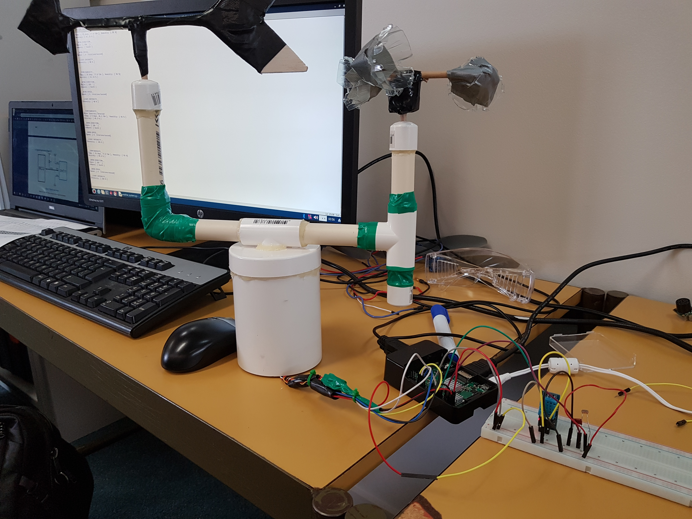

<!--
*** Based on the Best-README-Template: https://github.com/othneildrew/Best-README-Template
***
*** To avoid retyping too much info. Do a search and replace for the following:
*** repo_name, project_title, project_description
-->

<!-- PROJECT SHIELDS -->
<!-- [![Release][release-shield]][release-url] -->
<!-- [![Last Commit][last-commit-shield]][last-commit-url] -->
<!-- [![Contributors][contributors-shield]][contributors-url] -->
<!-- [![Forks][forks-shield]][forks-url] -->
<!-- [![Stargazers][stars-shield]][stars-url] -->
<!-- [![Issues][issues-shield]][issues-url] -->
<!-- [![MIT License][license-shield]][license-url] -->
<!-- [![LinkedIn][linkedin-shield]][linkedin-url] -->

<!-- PROJECT LOGO -->
 

<!--    -->

  <h2 align="center">Raspberry Pi Weather Station</h2>

  

    Python code for a weather station that can detect temperature, light level, wind speed and wind direction.
     
    Copy of an old college project from <b>2019</b>.
     
<!--     <a href="https://github.com/Tim-W-James/repo_name"><strong>Explore the docs »</strong></a>
      
      -->
<!--     <a href="https://github.com/Tim-W-James/repo_name">View Demo</a> -->
<!--     ·
    <a href="https://github.com/Tim-W-James/repo_name/issues">Report Bug</a> -->
<!--     ·
    <a href="https://github.com/Tim-W-James/repo_name/issues">Request Feature</a> -->
  

<!-- TABLE OF CONTENTS -->

  
Table of Contents

  <ol>
    <li>
      <a href="#about-the-project">About The Project</a>
      <ul>
        <li><a href="#features">Features</a></li>
        <li><a href="#built-with">Built With</a></li>
      </ul>
    </li>
    <li>
      <a href="#getting-started">Getting Started</a>
      <ul>
<!--         <li><a href="#prerequisites">Prerequisites</a></li> -->
<!--         <li><a href="#installation">Installation</a></li> -->
      </ul> 
    </li>
<!--     <li>
        <a href="#usage">Usage</a>
        <ul>
        <li><a href="#example-usecases">Example Usecases</a></li>
        </ul>
    </li> -->
<!--     <li><a href="#roadmap">Roadmap</a></li> -->
<!--     <li><a href="#contributing">Contributing</a></li> -->
<!--     <li><a href="#license">License</a></li> -->
    <li><a href="#contact">Contact</a></li>
<!--     <li><a href="#acknowledgements">Acknowledgements</a></li> -->
  </ol>

<!-- ABOUT THE PROJECT -->
## About The Project

Python program for a Raspberry Pi weather station circuit that interfaces with various sensors to collect data.

### Features

* Humidity sensor
* Temperature sensor
* Light level sensor
* Wind direction
* Wind speed

### Built With

* Raspberry Pi
* Python
* Breadboard circuit

<!-- GETTING STARTED -->
## Getting Started

1. Install the [RPi OS](https://www.raspberrypi.org/software/operating-systems/) on a Raspberry Pi
2. Ensure sensors are connected to pins described at the top of the [python file](https://github.com/Tim-W-James/Raspberry-Pi-Weather-Station/blob/main/weather_system.py)
3. Run the python program

<!-- CONTACT -->
## Contact

Email: [tim.jameswork9800@gmail.com](mailto:tim.jameswork9800@gmail.com "tim.jameswork9800@gmail.com")

Project Link: [https://github.com/Tim-W-James/Raspberry-Pi-Weather-Station](https://github.com/Tim-W-James/Raspberry-Pi-Weather-Station)

[product-screenshot]: FullStation.jpg

<!-- USEFUL LINKS FOR MARKDOWN
* https://www.markdownguide.org/basic-syntax
* https://www.webpagefx.com/tools/emoji-cheat-sheet
* https://shields.io
* https://choosealicense.com
* https://pages.github.com
* https://daneden.github.io/animate.css
* https://connoratherton.com/loaders
* https://kenwheeler.github.io/slick
* https://github.com/cferdinandi/smooth-scroll
* http://leafo.net/sticky-kit
* http://jvectormap.com
* https://fontawesome.com -->
